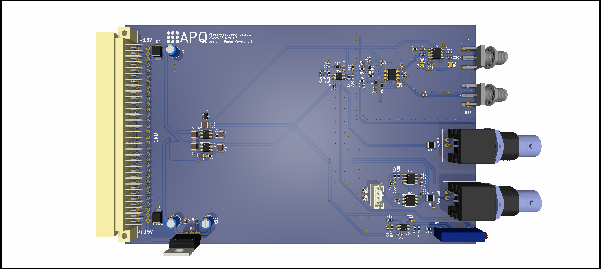
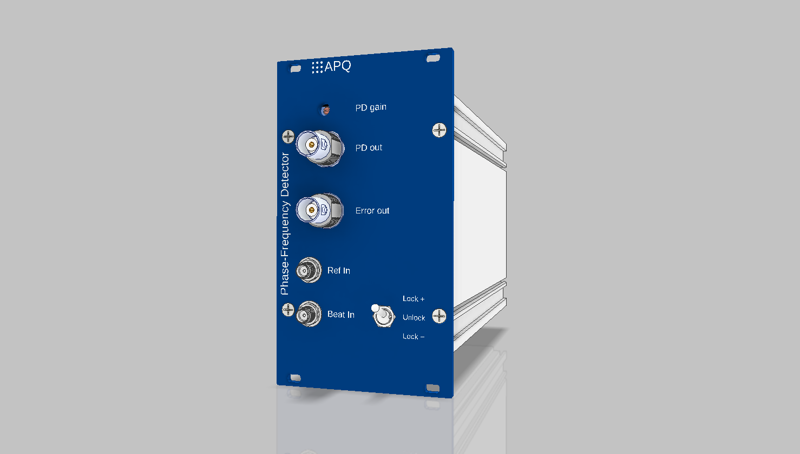

Phase-Frequency Detector
=====================
This repository contains the [KiCad](https://www.kicad.org/) design files of a phase-frequency detector designed for application in optical phase-locked loops (OPLL). The detector compares a beat-note signal with a reference signal and creates an output signal proportional to the phase deviation of the beat-note from the reference. Optionally, the beat-note input can be equipped with a divider (default: 4) for a larger input-frequency range.  The module also comprises a fast analog proportional-derivative controller for high-bandwidth feedback. 

**Features**

- Input frequency range

  - 10 MHz to 1.3 GHz without divider

  - 500 MHz to 5.2 GHz with divider (HMC365)

- Input signal level: -10 dBm to +10 dBm

- Error signal output:

  - Bandwidth 4 MHz (2. order filter)

  - Output voltage ±1 V max. (high-Z)

- PD controller

  - Output voltage ±5 V max. (high-Z)
  - Level adjustable between 4% and 100% via frontpanel trim pot
  - Gain sign adjustable via frontpanel switch
  - Hardware adjustable corner-frequency (default: 0.8 MHz) and gain limit (default: 32 dB)

Assembly
---------------

The PCB is placed in a standard 19''-rack mount unit. Use the [switch breakout board](https://github.com/TU-Darmstadt-APQ/phase-frequency_detector_switch_breakout) for connecting the frontpanel switch of the PD controller. See `frontpanel/` folder for drawings and frontpanel artwork.

 Design Files
-------------------
The design files can be found on the [releases](../../releases) page and include the following resources:

- Schematics as a PDF
- Gerber files
- Pick & place position files
- Bill of materials as a CSV file and also as an interactive HTML version

The latest revision of those files can be found [here](../../releases/latest).

Related work
--------------------
T. Preuschoff, *Laser Technologies for Applications in Quantum Information Science*, Ph.D. thesis, TU Darmstadt, 2023, [https://tuprints.ulb.tu-darmstadt.de/23242/](https://tuprints.ulb.tu-darmstadt.de/23242/)

Requirements
----------------------
- Dual power supply
   - +15 V (0.5 A typ.)
   - \- 15 V (0.1 A typ.)
- 19-inch rack mount (e.g. [Fischer Elektronik BGT384](https://www.fischerelektronik.de/web_fischer/en_GB/cases/N05.1/19%22%20subracks/$catalogue/fischerData/PR/BGT384_180/search.xhtml))

License
-----------

This work is released under the CERN OHL v.1.2
See www.ohwr.org/licenses/cern-ohl/v1.2 or the included LICENSE file for more information.